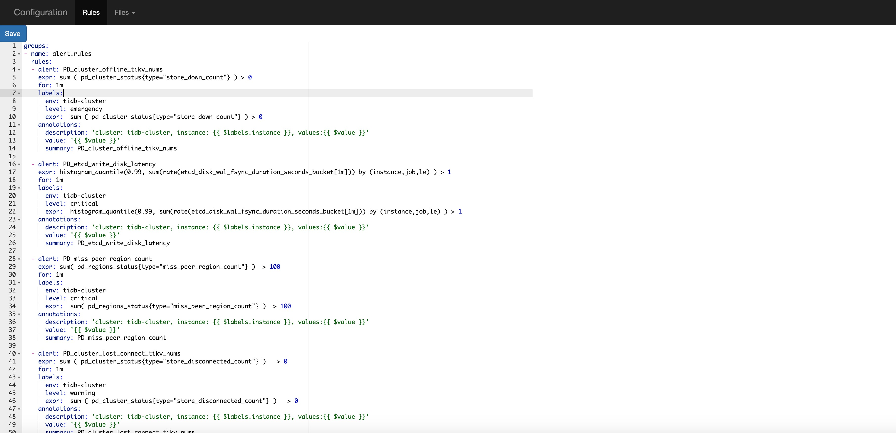

# Overview
This repo contains two functions. One support dynamic reload rules of prometheus, the other is used to support multi TiDB version.

## Function1 - Dynamic reload rules of Prometheus
It is a simple binary to trigger a reload when Rules are updated. It watches dirs and call `reload` API that the rules has been changed. 
It provide a UI to update rules(For ease of use, the UI is very like UI of Prometheus).


The text editor is friendly to Yaml format. To quickly verify that the modification is successful, there is Rules UI which get rules from Prometheus (You can also verify it by Prometheus.)

## Function2 - Cloud TiDB Monitoring
## How to use it
```$xslt
make
```
There is binary in `reload/build/{plateform}/reload`, you can run it like this
```$xslt
./reload --watch-path=/tmp/prometheus-2.8.0.darwin-amd64/rules --prometheus-url=http://127.0.0.1:9090
```

## Overview

Generate versioned monitoring data that is used by tidb-operator. This project pulls TiDB monitoring data from [tidb-ansible](https://github.com/pingcap/tidb-ansible) and uses the git tag to understand the TiDB version.

All TiDB version monitoring information is automatically generated (by default it generates for TiDB version >= 2.1.8). The structure of monitor directory is like this

```$xslt
 monitor/
    |── v2.1.8
    |   ├── dashboards
    |   │   ├─ overview.json 
    |   │   ├─ binlog.json  
    |   │   |_ pd.json
    |   |   |_ tikv_pull.json
    |   |   |_ tidb.json 
    |   |   
    |   |── rules
    |   |   ├── tidb.rule.yml
    |   |   ├── tikv.rule.yml
    |   |   └── pd.rule.yml
    |   |—— Dockerfile     
    |   |__ init.sh
    |
    |── v3.0.0
    |   ├── dashboards
    |   │   |- overview.json 
    |   │   |- binlog.json  
    |   │   |- pd.json
    |   |   |- tidb.json 
    |   |   |- tikv_details.json
    |   |   |- tikv_sumary.json
    |   |   |_ tikv_trouble_shooting.json
    |   |   
    |   |── rules
    |   |   ├── tidb.rule.yml
    |   |   ├── tikv.rule.yml
    |   |   └── pd.rule.yml
    |   |—— Dockerfile     
    |   |__ init.sh
    |___ ...
        
```


## How to use it
```$xslt
make
```
There will be monitoring binary, you can run it like this
```$xslt
./monitoring --path=.
```
The program will replace some variables and the docker will receive 4 variables: 
```$xslt
GF_PROVISIONING_PATH // grafana provisioning path
TIDB_CLUSTER_NAME // TiDB cluster name
TIDB_ENABLE_BINLOG // whether enable binlog
PROM_CONFIG_PATH // proemtheus rules config path
```
